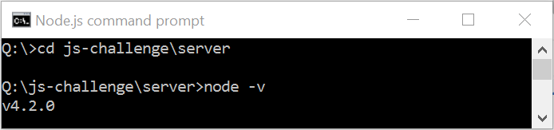
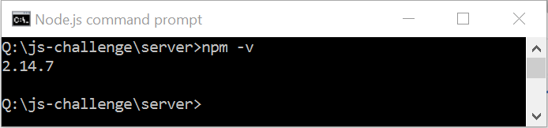
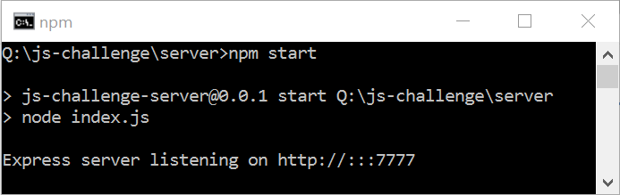

# JS challenge

Данный челлендж предназначен для того, что бы выполняющий его мог разобраться с такими вещами как:
- добавление и удаление классов у элементов
- изменение контента с помощью JS
- принципы работы data атрибутов тегов
- изменение атрибутов тегов
- что такое AJAX и как с ним работать
- обработчики событий в JS

+!


##Подготовка

Перед тем, как преступить к выполнению челленджа убедитесь, что у вас установлены [node.js](https://nodejs.org)



и [npm](https://www.npmjs.com)



## Запуск сервера

В консоли из папки js-challenge/server выполнить команду npm start



## Начало разработки

В папке solution создать папку с вашим логином в GitHub.
В этой папке должно быть 2 файла: index.html и main.js

Начальное содержание файла index.html
```html
<!DOCTYPE html>
<html lang="en">
<head>
  <meta charset="UTF-8">
  <title>JS challenge</title>
  <link rel="stylesheet" type="text/css" href="../../styles.css">
  <link rel="stylesheet" type="text/css" href="../../loader.css">
  <script src="https://code.jquery.com/jquery-2.1.4.min.js"></script>
</head>
<body class="body loading">
  <div class="root">
    <a href="#" class="left"></a>
    <a href="#" class="right"></a>
    <div class="category">
      <p></p>
    </div>
    
    <div class="description">
      <p class="title"></p>
      <p class="content"></p>
    </div>
  </div>
  <div class="ball-triangle-path"><div></div><div></div><div></div></div>
  <div class="wrapper"></div>
  <script src="./main.js"></script>
</body>
</html>
```

Данные каждой новости можно получить отправив GET запрос на http://localhost:7777/news/id , где id это id конкретной новости.
При загрузке страници должна грузится новость с id = 1

```html
http://localhost:7777/news/1
```

Иконка загрузки должна появляться в тот момент, когда запрос к серверу отправлен, а ответа еще нет. И пропадать после получения ответа.

Иконка загрузки появляется в том случае, если у body есть класс loading

```html
<body class="body loading">
```
